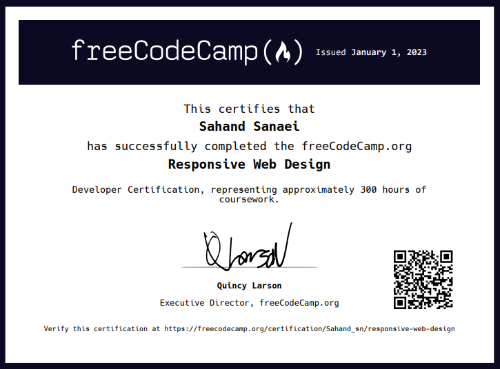

# FreeCodeCamp Projects
---
[FreeCodeCamp](https://www.freecodecamp.org/) is an invaluable open source project that has been helping people all around the world to learn and break in the tech space with online learning tools, ranging from bite-size reading articles to interactive coding lessons. 

## Responsive Web Design Projects
---
You can check out my projects [here](https://www.freecodecamp.org/certification/Sahand_sn/responsive-web-design).
